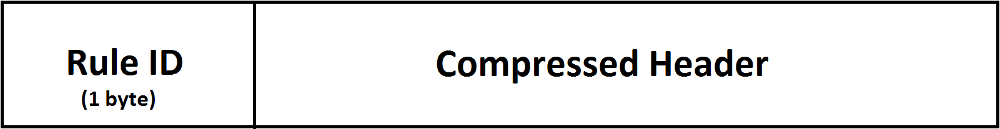
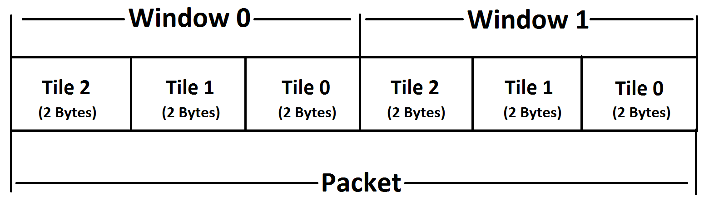

#SCHC implemetation for LoRaWAN packet creation

This document contains details and information on the different modules used to implement the SCHC protocol (mainly Header compression and, if necessary, DLMS payload fragmentation) to transmit DLMS data over a LoRaWAN network on the Uplink side. The details of the working of each module, the dataflow and the variables used in each module to achieve the same have been highlighted here. All the modules have been designed and implemented keeping in mind the IPv6 protocol and its features.

##Table of contents:
1. [Installations](#1.-installations) 
2. [Introduction](#2.-introduction)
3. [LoRaWAN Packets](#3.-lorawan-packets)

    3.1 [IPv6 Header format](#3.1-ipv6-header-format)

##1. Installations
To run these codes one simply needs to install python version 3. The only libraries used are import ,random - which are standard python libraries and hence need no installation- and other developed python files placed in the appropriate directories. 

##2. Introduction 
The information that is to be transmitted has a limited bandwidth of 125KHz in a LoRaWAN architecture, for reasons such as power constraints on the devices and the on-going spectral feud. Because of these reasons, at any given point in time the maximum amount of data that can be transmitted is 51 bytes. These 51 bytes of data must include everything including the header of the LoRaWAN packet, the header of the actual DLMS payload(IPv6 header) and the DLMS payload itself. Due to said constraints, the transmission would be very efficient if one could compress the data with a set of fixed(static) rules (constraints) given on both the transmitter and the receiver sides. Thus the SCHC(Static Context Header Compression) protocol is used to compress the header and if necessary fragment the DLMS payload data. The fragmentation is carried out if the payload data is bigger than what can be accommodated in the LoRaWAN packet and each successive part of the fragments are sent in successive LoRaWAN packets. It is to be noted that in any and all parts of this particular document, since it only discusses the Uplink, the terms ‘Transmitter’ and ‘Receiver’ refer to the Radio Gateway (RGW) and the Network Gateway (NGW) respectively unless otherwise mentioned.

For furthur information on the SCHC protocol snd the LoRaWAN architecture this [link](https://datatracker.ietf.org/doc/rfc8724/?include_text=1) can be visited.

##3. LoRaWAN Packets
This section is aimed to give a brief on how the LoRaWAN packet is structured. It gives the skeletal information about the IPv6 header, SCHC packet ,the structure of the LoRaWAN header and payload,etc. IT is to be noted that this section does not potray a comprehensive explanation for the same. If one needs a comprehensive explanation the link above can be used.

###3.1 IPv6 Header format
The IPv6 header has 8 fields in it, occupying a total of 40 bytes of data. The below diagram represents the fields and the length of each one in bits.

 

Due to bandwidth constraints present in this particular architecture, one cannot afford to send 40 bytes worth of data just for the header and have just 11 bytes leftover for the rest. Due to these reasons it would be wise to compress the header before transmitting it so as to save space on the LoRaWAN packet for the actual payload data to be sent.

###3.2 SCHC Packet
Due to the reasons given in the previous section, the IPv6 header is compressed before it is sent.The process of compression is based on a set of rules that is known to both the transmitter and reciever (hence the term Static Context). Sometimes the DLMS data(payload) might be too large to fit into the 51 byte limit of the LoRaWAN packet, and so it is fragemented and sent in multiple successive packets.Like the header, the payload is fragmented using a set of rules known to both the transmitter and receiver. Appropriate information is sent along with the compressed header and fragmented payload in order to reconstruct it at the receiver using the set of rules at the receiver side. 

The rules mentioned above, for both compression and fragmentation are maintained on both the transmitte and receiver ends in the form of, what can be dubbed as, *rule books*. Each rule has its own combination or way of dealing with the data to be transmitted. The combination can be defined by the programmer depending on the need or nature of the data. Each rule is identified by a *Rule ID* ,which is sent along with the SCHC packet, this allows the receiver to use the correct rule in order to reconstruct the data on reception.   

####3.2.1 SCHC Header
The SCHC header is a compressed version of the original IPv6 packet. The methods that can be used for compression are specified in the following [link](https://datatracker.ietf.org/doc/rfc8724/?include_text=1). These methods are applied on each of the 8 fields present in the header.In this particular document and the codes related to it, for the purposes of simplicity, only two methods are used. They are:

* sent
* not-sent

The sent method sends the particular header without making any changes. This option is usually selected if the receiver does not know the value of that particular field.

The not-sent method does not send a partcular field in the header. This option is selected if the receiver knows the value of that particular field and can reconstruct that field on its side. 

The format of the compressed SCHC header is as shown below.
 

The first part of the SCHC header is the Rule ID which occupies a space of not more than 1 byte. The rest is the compressed header,and in this case is simply a concatenation of those fields that have to be sent.

####3.3.2 SCHC Payload
Now that the header is compressed, the payload has to be fragmented.

The payload fragmentation is done by grouping the bytes present in the payload into tiles. These tiles can be furthur grouped into windows(optional) and a set number of these are sent in each packet depending on the space avaiable.

The windows in each fragment are indexed starting from 0 whereas the number of tiles in a particular window are index in the descending order

For example if one assumes that each tile has 2 bytes of data and each window has 3 tiles and each packet has 2 windows, the leftmost window would have the index as 0 and the next one would have the index as 1. The leftmost tile in window 0 would be indexed as 2, the next tile would be indexed 1 and the last tile would be 0.The same tile indexing would be followed for all sunsequent windows. A representation of the window and tile indexing is as shown below.

It is to be noted that while the size of the tiles and windows are mentioned, the last tile of a window and the last window of a packet can have lesser amounts of data in order to fit the packet.

 

 

